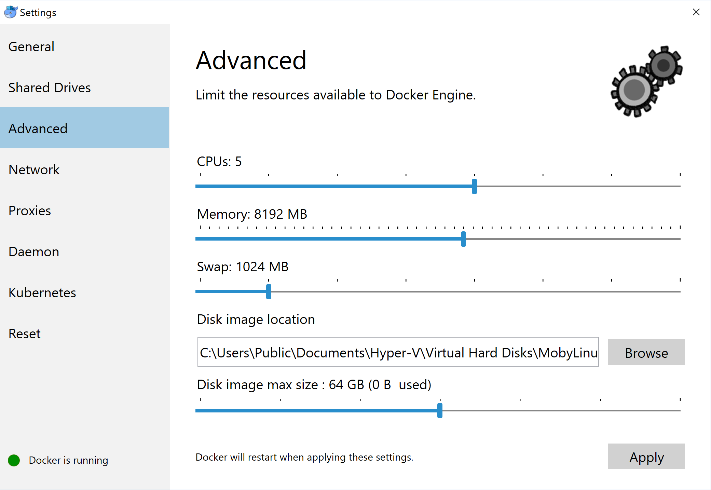

## 1. Windows Docker Desktop (recommended)

!!! warning
    Before installation, please check [this page](https://docs.docker.com/desktop/windows/install/#system-requirements) for system requirements.
    If your system does not fulfill the prerequisite, you may see the image as follow. Please use *[Docker Toolbox on Windows](#2-docker-toolbox-on-windows)* instead.

    

Download the image from [this link](https://hub.docker.com/editions/community/docker-ce-desktop-windows) and follow the installer step by step.

Once you have successfully installed docker desktop, you may click the button "Docker Desktop".
It may take a few minutes to start the service.
You may keep a watch on the whale on the right button.

Double click the whale button, and we can find a window to modify some of the properties.

Please go to the advanced tab and click the drivers **you wish to share with the docker container**.
Note: if your homework is located on Disk-D, you may not select Disk-C, this could make your operation system safer.

Go to the advanced tab, and you can edit the maximum memory used by docker.

If you can execute the command `docker ps -a` and `docker-compose` without any error message returned, your configuration is successful.

## 2. Docker Toolbox on Windows

You may install [Docker Toolbox on Windows](https://docs.docker.com/toolbox/toolbox_install_windows/) instead.

Going to the instruction page, click "[Get Docker Toolbox for Windows](https://download.docker.com/win/stable/DockerToolbox.exe)", you will download an installer.
You are supposed to install Docker and VirtualBox during this wizard.

Click "Docker Quickstart Terminal", you should be able to start a bash session.
Close it, click virtual box.
You may find there is one virtual machine is running.
Close this machine, update the maximum base memory.

Click the "Docker Quickstart Terminal" and your docker is ready.

###  FAQ

**Q:  VirtualBox will not boot a 64bits VM when Hyper-V is activated**

You may meet message as follow:

> Error with pre-create check: "This computer is running Hyper-V. VirtualBox won't boot a 64bits VM when Hyper-V is activated.
> Either use Hyper-V as a driver, or disable the Hyper-V hypervisor. (To skip this check, use --virtualbox-no-vtx-check)

You can not run VirtualBox on a system with Hyper-V enabled.
Hyper-V is a tier-1 hypervisor, which does not accept other hypervisors (from [here](https://forums.docker.com/t/unable-to-run-the-docker-toolbox/37403/3))

1. It seems like Docker for Windows has already resolved this issue
2. Try to [disable Hyper-V](https://superuser.com/questions/540055/convenient-way-to-enable-disable-hyper-v-in-windows-8). **Caution:** According to some reports, this operation may damage his/her network and had to reinstall all network adapters to get Internet back, or even getting a blue screen error.
3. Try to use Hyper-V as your backend driver. [https://docs.docker.com/machine/drivers/hyper-v/](https://docs.docker.com/machine/drivers/hyper-v/)
