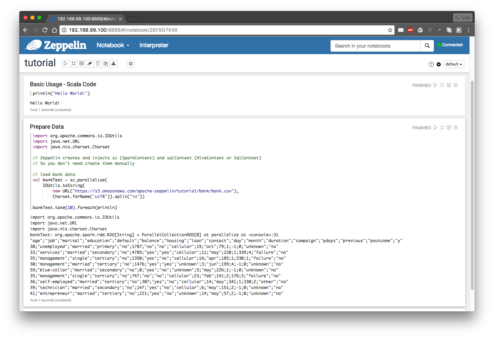
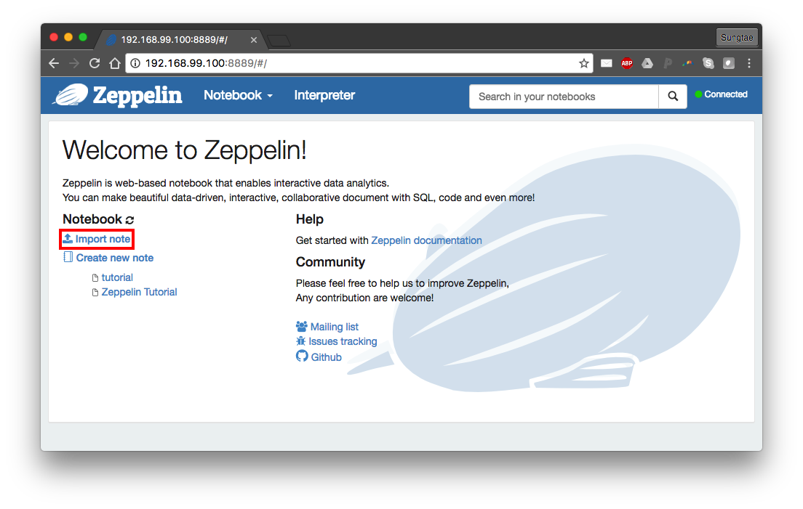

# Zeppelin

## 1. Preparation

Please prepare your docker environment and start your Zeppelin service.
The instructions can be found in [this section]({{base_path}}/teaching/002-bigdata-bootcamp-docker).


You can use shared folders between your local OS and the virtual environment on Docker.
These folders can be used to access data from your local and to save data after you exit/destroy your virtual environment.
Use `-v` option to make a shared folder from an existing local folder and a folder in a virtual environment:

```bash
-v <local_folder:vm_folder>
```

You should use the absolute path for `vm_folder`, but it does not need to exist.
For example, if want to use `~/Data/` in my local OS as the shared folder connected with `/sample_data`/` in the VM, I can start a container as follows:

```bash
docker run -it --privileged=true \
  --cap-add=SYS_ADMIN \
  -m 8192m -h bootcamp1.docker \
  --name bigbox -p 2222:22 -p 9530:9530 -p 8888:8888\
  -v /path/to/Data/:/sample_data/ \
  sunlab/bigbox:latest \
  /bin/bash
```

## 2. Install Zeppelin and start service

### 2.1. Installation

If you have not installed Zeppelin, you can install it with

```bash
/scripts/install-zeppelin.sh
```

You may encounter this error while installing Zeppelin:
```bash
ERROR: cannot verify sunlab.org's certificate, issued by ‘/C=US/O=Let's Encrypt/CN=R3’:
  Issued certificate has expired.
To connect to sunlab.org insecurely, use `--no-check-certificate'.
```

To resolve this issue, you may need to modify the `install-zeppelin.sh` script using
```bash
vi ./scripts/install-zeppelin.sh
```
This will enter the `vi` editor in the terminal.
In the editor, navigate to line 25 starting with `wget ...`, hit `i` to switch to the insert mode, and add the argument `--no-check-certificate` at the end.
The updated line will look like
```bash
wget http://sunlab.org/teaching/download/zeppelin-0.7.3-bin-netinst.tgz --no-check-certificate
```
Once you have finished doing so, hit `Esc` to exit the insert mode, type `:wq`, and hit `Enter` to exit `vi` editor.

You will be able to install `zeppelin` with `./scripts/install-zeppelin.sh` now.

### 2.2. Starting service

Then, you can start Zeppelin service with
```bash
/scripts/start-zeppelin.sh
```

!!! warning
    Make sure you have already started other necessary services with `./scripts/start-services.sh` before installing Zeppelin.

In addition, we need to create an HDFS folder for the user `zeppelin` as:

```bash
sudo su - hdfs  # switch to user 'hdfs'
hdfs dfs -mkdir -p /user/zeppelin  # create folder in hdfs
hdfs dfs -chown zeppelin /user/zeppelin  # change the folder owner
exit
```

You can check whether it has been created or not by using:

```bash
hdfs dfs -ls /user/
```

## 3. Open Zeppelin Notebook in your browser

Once you have started Zeppelin service and have created the HDFS folder for Zeppelin, you can access Zeppelin Notebook using your local web browser.

Open your web browser, and type in the address:

```bash
<host-ip>:<port-for-zeppelin>
```

For example, the address is `192.168.99.100:9530` if the IP address assigned to your Docker container is `192.168.99.100`, and the port number assigned to Zeppelin service is `9530` as default in our Docker image.

!!! info
    You can check your docker host IP address using `ifconfig` (Linux/macOS) or `ipconfig` (Windows).
    The IP address is located at `Ethernet adapter vEthernet->IPv4 Address`.

    In fact, the docker host IP address is automatically mapped to url [http://host.docker.internal](http://host.docker.internal).
    So, a simpler approach is directly using the url [http://host.docker.internal:9530](http://host.docker.internal:9530) to access Zeppelin Notebook ([reference](https://docs.docker.com/desktop/windows/networking/)).

Once you navigate to that IP address with the port number, you will see the front page of Zeppelin like


## 4. Create a new Notebook

Click on 'Create new note', and give a name, click on 'Create Note':
Then, you will see a new blank note:


Next, click the gear icon on the top-right, interpreter binding setting will be unfolded.
Default interpreters will be enough for the most of cases, but you can add/remove them at 'interpreter' menu if you want to. Click on 'Save' once you complete your configuration.


## 5. Basic usage

You can click the gear icon at the right side of the paragraph. If you click 'Show title' you can give a title as you want for each paragraph.
Try to use other commands also.


### 5.1. Text note

Like other Notebooks, e.g., Jupyter, we can put some text in a paragraph by using `md` command with Markdown syntax:

```
%md
<some text using markdown syntax>
```

Afterwards, click the `play` button or use key combination `Shift+Enter` to run the paragraph.
It will show formatted Markdown text.
You can also choose to show or hide editor for better visual effect.


### 5.2. Scala code

If you bind default interpreters, you can use scala codes as well as Spark API in a paragraph directly:


Again, do not forget to actually run the paragraph.

### 5.3. Possible Error
If you encounter an error related to HDFS, please check whether you have created an HDFS user folder for 'zeppelin' as described above.

## 6. Load Data Into Table

We can use SQL query statements for easier visualization with Zeppelin.
Later, you can fully utilize Angular or D3 in Zeppelin for better or more sophisticated visualization.

Let's get the "Bank" data from the official Zeppelin tutorial.

!!! info
You can find the tutorial at `Zeppelin Tutorial/Basic Features (Spark)` on the Welcome page.



Next, define a `case class` for easy transformation into `DataFrame` and map the text data we downloaded into DataFrame without its header. Finally, register this DataFrame as `Table` to use sql query statements.


## 7. Visualization of Data via SQL query statement

Once data is loaded into `Table`, you can use `SQL` query to visualize the data you want to see:

```sql
%sql
<valid SQL statement>
```

Let's try to show a distribution of age of those who are younger than 30.


As you can see, the visualization tool will be automatically loaded once you run a paragraph with an SQL statement.
The default one is the result table of the query statement, but you can choose other types of visualization such as bar chart, pie chart, and line chart by just clicking the icons.


Also, you can change configurations for each chart as you want

### 7.1. Input Form

You can create an input form by using `${formName}` or `${formName=defaultValue}` templates.


### 7.2. Select Form

Also, you can create a select form by using `${formName=defaultValue,option1|option2...}`


For more dynamic forms, please refer to [zeppelin-dynamicform](https://zeppelin.apache.org/docs/latest/manual/dynamicform.html)

## 8. Export/Import Notebook

Once you've finished your work, you can export Notebook as a JSON file for later use.


Also, you can import Notebook exported as JSON or from URL.




!!! info
    You can download the JSON file for this tutorial [here](https://gist.githubusercontent.com/yuikns/b7fc51a56e936e29f1577456c1b47563/raw/17d25875d7fd73eedaa67bc2f02e0a115110c233/tutorial.json) or see the official 'Zeppelin Tutorial' on the frontpage of Zeppelin.

